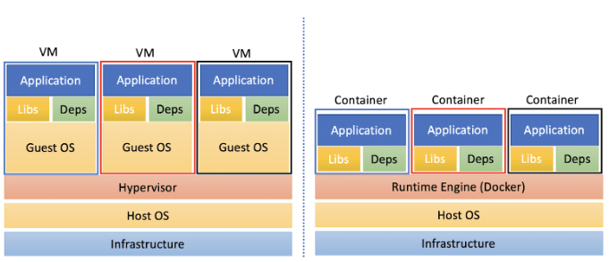
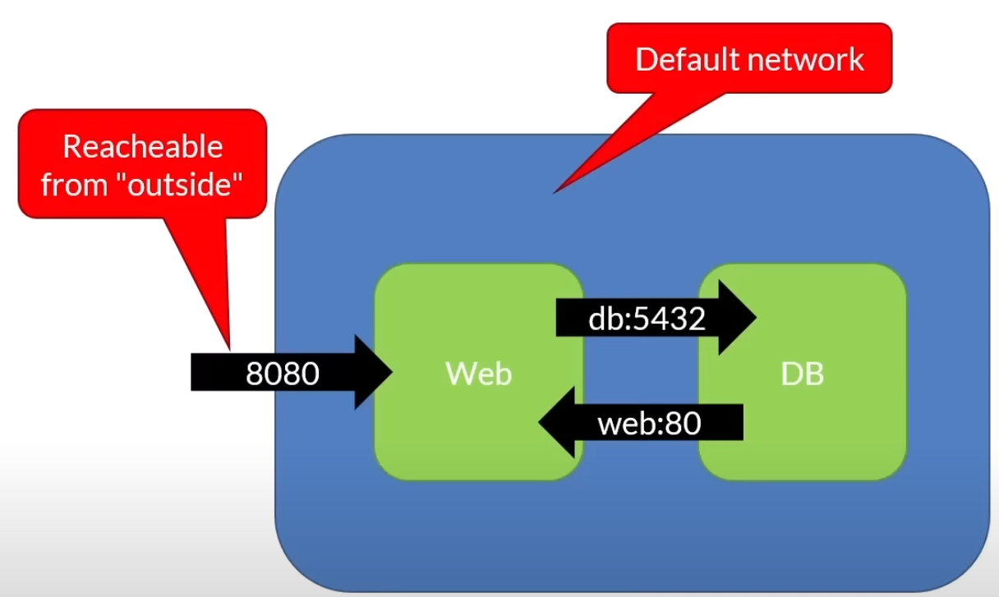
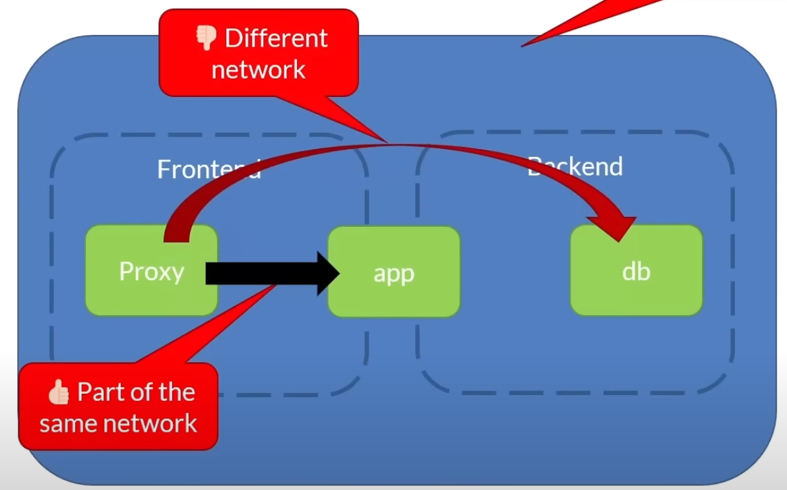

The information is taken from: [Docker and k8s course.](https://www.youtube.com/watch?v=kTp5xUtcalw&t=1724s&ab_channel=freeCodeCamp.org)
# DOCKER 
## Basic concept 
The images run within a container. The container can be thought as a very lightweight VM. The main difference with an actual VM is that it shares HW and Kernel with the host machine rather than virtualizing it as in an actual VM. \
Within this container the images descibe what is running: os, program installed, etc.


### Image vs container
```
To use a programming metaphor, if an image is a class, then a container is an instance of a class.
Think of a Docker container as a running image instance. You can create many containers from the same image, each with its own unique data and state.
```
<strong> Image </strong>:  
Images are read-only templates containing instructions for creating a container. A Docker image creates containers to run on the Docker platform.
Think of an image like a blueprint or snapshot of what will be in a container when it runs.
An image is composed of multiple stacked layers, like layers in a photo editor, each changing something in the environment. Images contain the code or binary, runtimes, dependencies, and other filesystem objects to run an application. The image relies on the host operating system (OS) kernel.  

<strong> Container </strong>:  
The major difference between a container and an image is the top writable layer. Containers are running instances of Docker images with top writable layer. Containers run the actual applications. A container includes an application and all of its dependencies. When the container is deleted, the writable layer is also deleted. The underlying image remains unchanged. Containers are hopefully why you're using Docker; they're lightweight and portable encapsulations of an environment in which to run applications.


## Basic commands
- `docker info` -> display system informantion \
- `docker version` -> display system version \
- `docker login` -> log in into Docker registry 

## Main commands 
- `docker pull [imageName]` -> pull an image from the registry  
- `docker run [imageName]` -> run container and enters the container terminal  
  - `... --name [desiredName]` -> run container with the specified name and enters the container terminal  
  - `... -d ` -> run container in detached mode, i.e. the container will run in the bg, not entering the container terminal  
  - `... --publish/-p [localHostPort:80]` -> map the host port to the container listening port.  
  -  `... -it -- [shellToAttach]` -> attach a shell to a starting container
```
example complete command: docker run --publish 0.0.0.0:8080:80 --name webserver nginx
```  

- `docker start [containerName]` -> start a stopped container  
- `docker ps` -> list RUNNING containers  
  - `docker ps -a` -> list ALL containers  
- `docker stop [containerName]` -> stop a running container, but the container still resides in memory  
- `docker kill [containerName]` -> kill containers  
- `docker image inspect [imageName]` -> get image info  
- `docker container exec -it [conteinerName] -- [shellToAttach]` -> attach a shell to a running container

## Clean up commands
- `docker rm [containerName]` -> remove stopped container
- `docker rm $(docker ps -a -q)` -> remove all stopped containers
- `docker images` -> list images cached locally
- `docker rmi [imageName]` -> delete an image
- `docker system prune -a` -> removes all images not used by any container

## Build containers
- `docker build -t [name:tag] .` -> build an image using a DOCKERFILE located in the SAME folder
  - `... -f [fileName]` -> build an image using a Dockerfile located in ANOTHER folder
- `docker tag [imageName] [name:tag]` -> tag an existing image (tag is usually a version number)

### DOCKERFILE
Is a text file containing instructions (steps) on how to build an image.
Example of a dockerfile (create a Node.js app):
```
FROM alpine 
RUN apk add -update nodejs nodejs.npm
COPY . /src
WORKDIR /src
RUN npm install
EXPOSE 8080
ENTRYPOINT ["node", "./app.js"]
```
- `FROM` -> defines the starting image. When creating a new image, one always starts from an existing one. 
- `RUN` -> use to run commands inside the container
- `COPY [fromFolder] [toFolder]` -> copies everythin from the specified folder (usually .) to the specified folder
- `WORKDIR` -> define the working directory
- `EXPOSE` -> metadata, tell the container to listen on this port
- `ENTRYPOINT` -> what to run when the container is started

## Volumes
Usually date are not stored in containers as they are not saved.  
Nonetheless, if we want data to persist, it is possible to do so using volumes, which is mapped to a folder in the filesystem. Basically a logical folder in the container which maps an actual folder on the host FS.

- `docker volume create [volumeName]` -> creates a new volume
- `docker volume ls` -> list the volumes
- `docker volume inspect [volumeName]` -> diplay volume info
- `docker volume rm [volumeName]` -> deletes a volume
- `docker volume prune` -> deletes all NOT MOUNTED volumes  
  
Example:
```
# create the volume
docker volume create myvol

# run a container with that volume attached
docker run -d --name devtest -v myvol:/[mappedFolderInTheContainer] nginx:latest
docker run -d --name devtest -v myvol:/app nginx:latest


# for testing purposes we can create and map temp folders in the contaier rather than volumes
docker run -d --name devtest -v d:/test:/[mappedFolderInTheContainer] nginx:latest
```

In order to remove a volume is necessary to stop and remove from memory all containers using it. 

## Docker Compose
Docker compose allows to define a single file to run multi-containers applications. It is defined using YAML files and run using docker CLI with the compose plugin.

The docker compose file must be named `docker-compose.yaml`.

`docker-compose ...` is compose v1 and was replaced in 2022 by v2 that now uses `docker compose ...`. All v1 commands are working as expected.

Example of a Docker compose file:
```
version: '3.9'

services: 
  webapi1:
    image: academy.azurecr.io/webapi1
    ports:
      - '8081:80'
    restart: always
  
  webapi2:
    image: academy.azurecr.io/webapi2
    ports:
      - '8082:80'
    restart: always
  
  apigateway:
    image: academy.azurecr.io/gateway
    ports:
      - '80:80'
    restart: always
```
This docker comose file defines 3 containers.  
The names are used within each container to reference other containers. For each of them there is the image location, the internal and external port. 

Docker compose is perfect for small orcherstration. When k8s would be overkill or when developing and testing.

### Docker compose commands
- `docker compose build` -> build the images
  - `... -f [fileLocation]`-> to specify the docker compose file location
- `docker compose start` -> start the containers
- `docker compose stop` -> stop the containers
- `docker compose up` -> build and start
  - `... -d` -> run in detach mode (in bg)
- `docker compose ps` -> list what's running
- `docker compose rm` -> remove from memory
- `docker compose down` -> stop and remove
- `docker compose logs` -> get logs
- `... -f [serviceName]` -> get logs for that specific service
- `docker compose exec [container] bash` -> open a session inside a container

### New commands (only v2)
- `docker compose --project-name (or -p) [projectName] up` -> run an instance as project
- `docker compose ls` -> list running projects
- `docker compose cp [containerId]:[srcPath] [destPath]` -> copy files FROM the container
- `docker compose cp [destPath] [containerId]:[srcPath]` -> copy files TO the container

### Additional parameters
#### Resources
The amount of resource used by each service can be defined in the docker-compose.yaml.
Ex:
```
service:
  redis:
    image: redis:alpine
    deploy:
      resources:
        limits: # massimum allocation possible
          cpus: '0.50'
          memory: 150M
        reservations: # initial allocation
          cpus: '0.25'
          memory: 20M
```

#### Environment variables
To set a varialbe env. that will be injected in the running instance the key-value pairs  must be set:
```
service:
  web:
    image: nginx:alpine
    environment:
      - DEBUG=1
      - FOO=BAR
```
This value can be overwritten through the command line with the -e parameter:
`docker compose up -d -e DEBUG=0`

Environment variables can be placed in a file `.env` located in the same folder as the docker-compose.yaml:
```
POSTGRES_VERSION=14.3
```
and then it can be referenced from the docker compose file:
```
services:
  db:
    image: "postgres:${POSTGRES_VERSION}
```

#### Networking
By default all containers specified in a compose file will see each other using their service names. 
For example: 
```
service:
  web:
    image: nginx:alpine
    ports:
      - "8080:80"
  db: 
    image: postgres
    ports:
      - "5432" # not mapping host port for this container, i.e. only accessible via 'web'
```

This means that the web container can communicate with the db container using his service name (db) as the host name and viceversa.

This means that the db is not accessible from the outside, but only through the 'web' container. 

If the application is more complex, is also possible to restirct who can see who by configuring different networks.

Example:
```
service:
  proxy:
    image: nginx:alpine
    networks:
      - frontend

  app:
    image: myapp
    networks:
      - frontend
      - backend

  db: 
    image: postgres
    networks:
      - backend

networks:
  - frontend
  - backend
```


In this case 'app' will be able to communicate with both 'db' and 'proxy' because 'app' shares the network with them, but 'proxy' won't be able to "see" or communicate with 'db' as they belong to different networks.

#### Dependency
It is possible to establish the execution order of the different services (container). For example, it is important to have the DB in place before the application starts:
```
services:
  app:
    image: myapp
    depends_on:
      - db
  db: 
    image: postgres
    networks:
      - backend
```

#### Volumes
It is possible to declare volumes that can be used by all services present in the compose file:
```
services:
  app:
    image: myapp
    depends_on:
      - db
  db: 
    image: postgres
    networks:
      - backend
    volumes:
      # to actually use the volume, it must be mapped to a local folder in the container
      - db-data:/etc/data 

volumes:
  - db-data:
```
Once the volumes are declared, when used by a service the mapping to the logic folder within the service must be created:

`[volumeName]:[logicalFolder]`
it can also be specified the type of permission on the volume:  
`[volumeName]:[logicalFolder]:[ro/rw]` -> ReadOnly or ReadWrite

Volumes can be also defined at service level. In this case they are NOT shared among services:
```
services:
  db: 
    image: postgres
    networks:
      - backend
    volumes:
      # to actually use the volume, it must be mapped to a local folder in 
      - ./db:/etc/data 
```

#### Restart policy
If not specified, the containers are not restarted under any circumstances.
Possible values:
`always` -> always restart the container until its removal
`on-failure` -> restart if the exit code indicates an error
`unless-stopped` -> always restart unless the contaier it's stopped or removed

```
services:
  db: 
    image: postgres
    restart: always 
```

## Container Registry
It is a central repository for images. Once the image is built locally, the image is pushed and stored to the repository. 
It can be private or public. 

The default is `hub.docker.com`, but each cloud vendor (AWS, Azure, GCP) offers its own repository as service.

When pushing an image to docker hub the image must be tagged and prefixed with the repository name.  
Workflow:
```
# login into docker hub
docker login

# tag the built image -> [repositoryName]/[imageToTag]:[tag]
docker tag my_image fedmag/my_image:latest 

# push the image
docker push fedmag/my_image:latest

# pull the image
docker pull fedmag/my_image:latest
```