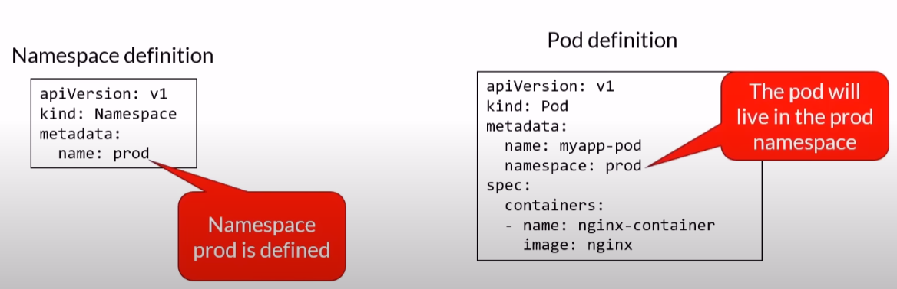
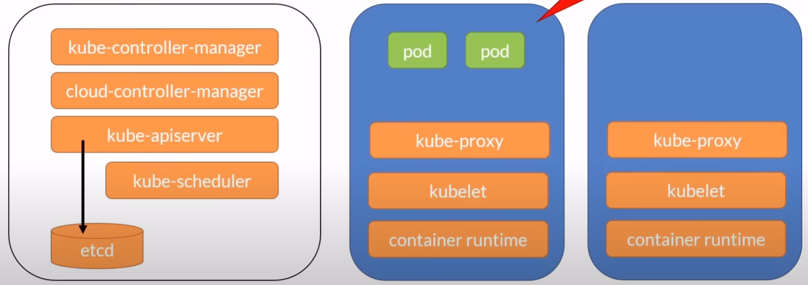
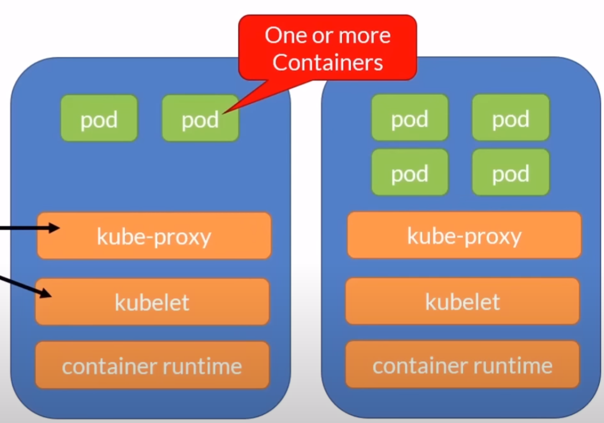
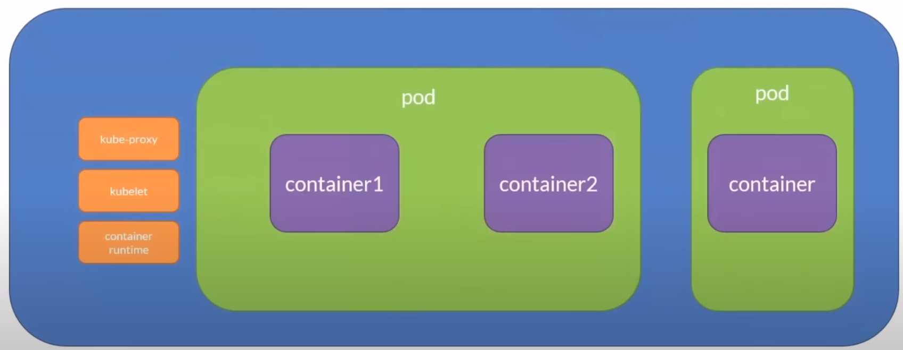
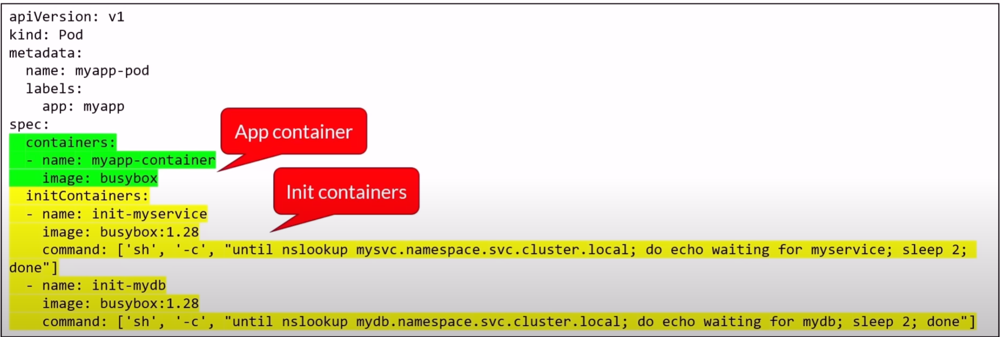

The information is taken from: [Docker and k8s course.](https://www.youtube.com/watch?v=kTp5xUtcalw&t=1724s&ab_channel=freeCodeCamp.org)
# Docker
## Basic concepts
The images run within a container. The container can be thought as a very lightweight VM. The main difference with an actual VM is that it shares HW and Kernel with the host machine rather than virtualizing it as in an actual VM. \
Within this container the images descibe what is running: os, program installed, etc.


### Image vs container
```
To use a programming metaphor, if an image is a class, then a container is an instance of a class.
Think of a Docker container as a running image instance. You can create many containers from the same image, each with its own unique data and state.
```
<strong> Image </strong>:  
Images are read-only templates containing instructions for creating a container. A Docker image creates containers to run on the Docker platform.
Think of an image like a blueprint or snapshot of what will be in a container when it runs.
An image is composed of multiple stacked layers, like layers in a photo editor, each changing something in the environment. Images contain the code or binary, runtimes, dependencies, and other filesystem objects to run an application. The image relies on the host operating system (OS) kernel.  

<strong> Container </strong>:  
The major difference between a container and an image is the top writable layer. Containers are running instances of Docker images with top writable layer. Containers run the actual applications. A container includes an application and all of its dependencies. When the container is deleted, the writable layer is also deleted. The underlying image remains unchanged. Containers are hopefully why you're using Docker; they're lightweight and portable encapsulations of an environment in which to run applications.


## Basic commands
- `docker info` -> display system informantion \
- `docker version` -> display system version \
- `docker login` -> log in into Docker registry 

## Main commands 
- `docker pull [imageName]` -> pull an image from the registry  
- `docker run [imageName]` -> run container and enters the container terminal  
  - `... --name [desiredName]` -> run container with the specified name and enters the container terminal  
  - `... -d ` -> run container in detached mode, i.e. the container will run in the bg, not entering the container terminal  
  - `... --publish/-p [localHostPort:80]` -> map the host port to the container listening port.  
  -  `... -it -- [shellToAttach]` -> attach a shell to a starting container
```
example complete command: docker run --publish 0.0.0.0:8080:80 --name webserver nginx
```  

- `docker start [containerName]` -> start a stopped container  
- `docker ps` -> list RUNNING containers  
  - `docker ps -a` -> list ALL containers  
- `docker stop [containerName]` -> stop a running container, but the container still resides in memory  
- `docker kill [containerName]` -> kill containers  
- `docker image inspect [imageName]` -> get image info  
- `docker container exec -it [conteinerName] -- [shellToAttach]` -> attach a shell to a running container

## Clean up commands
- `docker rm [containerName]` -> remove stopped container
- `docker rm $(docker ps -a -q)` -> remove all stopped containers
- `docker images` -> list images cached locally
- `docker rmi [imageName]` -> delete an image
- `docker system prune -a` -> removes all images not used by any container

## Build containers
- `docker build -t [name:tag] .` -> build an image using a DOCKERFILE located in the SAME folder
  - `... -f [fileName]` -> build an image using a Dockerfile located in ANOTHER folder
- `docker tag [imageName] [name:tag]` -> tag an existing image (tag is usually a version number)

### DOCKERFILE
Is a text file containing instructions (steps) on how to build an image.
Example of a dockerfile (create a Node.js app):
```
FROM alpine 
RUN apk add -update nodejs nodejs.npm
COPY . /src
WORKDIR /src
RUN npm install
EXPOSE 8080
ENTRYPOINT ["node", "./app.js"]
```
- `FROM` -> defines the starting image. When creating a new image, one always starts from an existing one. 
- `RUN` -> use to run commands inside the container
- `COPY [fromFolder] [toFolder]` -> copies everythin from the specified folder (usually .) to the specified folder
- `WORKDIR` -> define the working directory
- `EXPOSE` -> metadata, tell the container to listen on this port
- `ENTRYPOINT` -> what to run when the container is started

## Volumes
Usually date are not stored in containers as they are not saved.  
Nonetheless, if we want data to persist, it is possible to do so using volumes, which is mapped to a folder in the filesystem. Basically a logical folder in the container which maps an actual folder on the host FS.

- `docker volume create [volumeName]` -> creates a new volume
- `docker volume ls` -> list the volumes
- `docker volume inspect [volumeName]` -> diplay volume info
- `docker volume rm [volumeName]` -> deletes a volume
- `docker volume prune` -> deletes all NOT MOUNTED volumes  
  
Example:
```
# create the volume
docker volume create myvol

# run a container with that volume attached
docker run -d --name devtest -v myvol:/[mappedFolderInTheContainer] nginx:latest
docker run -d --name devtest -v myvol:/app nginx:latest


# for testing purposes we can create and map temp folders in the contaier rather than volumes
docker run -d --name devtest -v d:/test:/[mappedFolderInTheContainer] nginx:latest
```

In order to remove a volume is necessary to stop and remove from memory all containers using it. 

## Docker Compose
Docker compose allows to define a single file to run multi-containers applications. It is defined using YAML files and run using docker CLI with the compose plugin.

The docker compose file must be named `docker-compose.yaml`.

`docker-compose ...` is compose v1 and was replaced in 2022 by v2 that now uses `docker compose ...`. All v1 commands are working as expected.

Example of a Docker compose file:
```
version: '3.9'

services: 
  webapi1:
    image: academy.azurecr.io/webapi1
    ports:
      - '8081:80'
    restart: always
  
  webapi2:
    image: academy.azurecr.io/webapi2
    ports:
      - '8082:80'
    restart: always
  
  apigateway:
    image: academy.azurecr.io/gateway
    ports:
      - '80:80'
    restart: always
```
This docker comose file defines 3 containers.  
The names are used within each container to reference other containers. For each of them there is the image location, the internal and external port. 

Docker compose is perfect for small orcherstration. When k8s would be overkill or when developing and testing.

### Docker compose commands
- `docker compose build` -> build the images
  - `... -f [fileLocation]`-> to specify the docker compose file location
- `docker compose start` -> start the containers
- `docker compose stop` -> stop the containers
- `docker compose up` -> build and start
  - `... -d` -> run in detach mode (in bg)
- `docker compose ps` -> list what's running
- `docker compose rm` -> remove from memory
- `docker compose down` -> stop and remove
- `docker compose logs` -> get logs
- `... -f [serviceName]` -> get logs for that specific service
- `docker compose exec [container] bash` -> open a session inside a container

### New commands (only v2)
- `docker compose --project-name (or -p) [projectName] up` -> run an instance as project
- `docker compose ls` -> list running projects
- `docker compose cp [containerId]:[srcPath] [destPath]` -> copy files FROM the container
- `docker compose cp [destPath] [containerId]:[srcPath]` -> copy files TO the container

### Additional parameters
#### Resources
The amount of resource used by each service can be defined in the docker-compose.yaml.
Ex:
```
service:
  redis:
    image: redis:alpine
    deploy:
      resources:
        limits: # massimum allocation possible
          cpus: '0.50'
          memory: 150M
        reservations: # initial allocation
          cpus: '0.25'
          memory: 20M
```

#### Environment variables
To set a varialbe env. that will be injected in the running instance the key-value pairs  must be set:
```
service:
  web:
    image: nginx:alpine
    environment:
      - DEBUG=1
      - FOO=BAR
```
This value can be overwritten through the command line with the -e parameter:
`docker compose up -d -e DEBUG=0`

Environment variables can be placed in a file `.env` located in the same folder as the docker-compose.yaml:
```
POSTGRES_VERSION=14.3
```
and then it can be referenced from the docker compose file:
```
services:
  db:
    image: "postgres:${POSTGRES_VERSION}
```

#### Networking
By default all containers specified in a compose file will see each other using their service names. 
For example: 
```
service:
  web:
    image: nginx:alpine
    ports:
      - "8080:80"
  db: 
    image: postgres
    ports:
      - "5432" # not mapping host port for this container, i.e. only accessible via 'web'
```

This means that the web container can communicate with the db container using his service name (db) as the host name and viceversa.

This means that the db is not accessible from the outside, but only through the 'web' container. 

If the application is more complex, is also possible to restirct who can see who by configuring different networks.

Example:
```
service:
  proxy:
    image: nginx:alpine
    networks:
      - frontend

  app:
    image: myapp
    networks:
      - frontend
      - backend

  db: 
    image: postgres
    networks:
      - backend

networks:
  - frontend
  - backend
```


In this case 'app' will be able to communicate with both 'db' and 'proxy' because 'app' shares the network with them, but 'proxy' won't be able to "see" or communicate with 'db' as they belong to different networks.

#### Dependency
It is possible to establish the execution order of the different services (container). For example, it is important to have the DB in place before the application starts:
```
services:
  app:
    image: myapp
    depends_on:
      - db
  db: 
    image: postgres
    networks:
      - backend
```

#### Volumes
It is possible to declare volumes that can be used by all services present in the compose file:
```
services:
  app:
    image: myapp
    depends_on:
      - db
  db: 
    image: postgres
    networks:
      - backend
    volumes:
      # to actually use the volume, it must be mapped to a local folder in the container
      - db-data:/etc/data 

volumes:
  - db-data:
```
Once the volumes are declared, when used by a service the mapping to the logic folder within the service must be created:

`[volumeName]:[logicalFolder]`
it can also be specified the type of permission on the volume:  
`[volumeName]:[logicalFolder]:[ro/rw]` -> ReadOnly or ReadWrite

Volumes can be also defined at service level. In this case they are NOT shared among services:
```
services:
  db: 
    image: postgres
    networks:
      - backend
    volumes:
      # to actually use the volume, it must be mapped to a local folder in 
      - ./db:/etc/data 
```

#### Restart policy
If not specified, the containers are not restarted under any circumstances.
Possible values:
`always` -> always restart the container until its removal
`on-failure` -> restart if the exit code indicates an error
`unless-stopped` -> always restart unless the contaier it's stopped or removed

```
services:
  db: 
    image: postgres
    restart: always 
```

## Container Registry
It is a central repository for images. Once the image is built locally, the image is pushed and stored to the repository. 
It can be private or public. 

The default is `hub.docker.com`, but each cloud vendor (AWS, Azure, GCP) offers its own repository as service.

When pushing an image to docker hub the image must be tagged and prefixed with the repository name.  
Workflow:
```
# login into docker hub
docker login

# tag the built image -> [repositoryName]/[imageToTag]:[tag]
docker tag my_image fedmag/my_image:latest 

# push the image
docker push fedmag/my_image:latest

# pull the image
docker pull fedmag/my_image:latest
```

# Kubernetes (K8s)
## Basic concepts
k8s is a container orchestration tool.  
MORE TO ADD

The k8s apiserver is running on the master node and exposes REST APIs that is the only point of communication for k8s clusters.

The desired state is expressed through a YAML file. Such desired state is sent to the cluster thorugh the CLI (kubectl), which uses the aforementioned REST APIs. Other applications such as dashboards communicates through the same REST APIs.

The `.kube` folder (C:/Users/[userName]/.kube) stores the information used by kubectl (such as the config and all the clusters information).

## Context
A group of access parameters to a k8s cluster. It contains:
- cluster name
- a user
- a namespace

The current context is the k8s cluster against which the kubectl commands will be executed.

### Commands

- `kubectl config current-context` -> get the current context
- `kubectl config get-contexts` -> list all context
- `kubectl config use-context [contextName]` -> set the current context
- `kubectl config delete-context [contextName]` -> delete a context from the config file
- `kubectl config rename-context [oldName] [newName]` -> rename context

## Declarative vs Imperative 
There are two ways of creating resources in k8s:
1. <strong>Imperative:</strong> using kubectl commands, issue a series of commands to create resources:
   ```
   kubectl run mynginx --image=nginx --port=80
   kubectl create deploy mynginx --image=nginx --port=80 --replicas=3
   kubectl create service nodeport myservice --targetPort=8080
   kubectl delete pod nginx
   ```
2. <strong>Declarative:</strong> using kubectl and YAML manifests that define the resources that are needed. The advantage is that this is reproducible, can be saved in source-control and can be parsed and modified:
   ```
    apiVersion: v1
    kind: Pod 
    metadata: 
      name: myapp-pod 
      labels:
        app: myapp
        type: front-end
    spec:
      containers:
      - name: nginx-container
      image: nginx  
   ```
    then kubectl is used to send the YAML file to the k8s cluster: `kubectl create -f [yamlFile]`

## Namespace
Allows to group resources (ex: dev, test, prod). Namespaces are kind of logical folders in which resources are grouped together.

k8s creates a default namespace. 

Objects in one namespace can access objects in a different one: `objectName.PROD.svc.cluster`.

Deleting a namespace will delete all its child objects.


### Commands
- `kubectl get namespace/ns` -> lists all namespaces in a cluster.
- `kubectl config  set-context --current --namespace=[nameSpace]` -> set the current context to a specific namespace
- `kubectl create ns [nameSpace]` -> create a namespace 
- `kubectl delete ns [nameSpace]` -> delete a namespace
- `kubectl get pods --all-namespaces` -> list all pods in all namespaces

## Nodes

Nodes are physical or virtual VMs. A group of nodes forms a <strong>cluster</strong>.
Among all the nodes there is one that control the others, the <storng>master node</strong>.

### Master Node
The master node (or control plane) contains the master components, a collection of k8s elements that are needed for the overall orchestration and functioning of k8s:

- etcd: key-value data store. Stores the cluster state. Not inteded to be used as DB by applications. Inside k8s this is the single source of truth.
- kube-apiserver: the only component talking to etcd. It exposes a REST interface and tools like k8s cli communicate through it. All the clients interact with it, never directly with the data store.
- kube-control-manager: the controller of controllers. It runs the other k8s controllers.
- cloud-control-manager: interact with the cloud providers controlleers. 
    - Node: for checking the cloud provider to determine is a node has been deleted in the cloud after it stops respondeing
    - Route: for setting up routes in the underlying cloud infrastracture
    - Service: for creating, updating and deleting cloud provider load balancers
    - Volume: for creating, attaching and mounting volumes. Also interacts with the cloud provider to orchestrates volumes.
- kube-scheduler: watches for newly created pods that have no nodes assigned and selects a node to run into such pods. For the scheduling decision the following is taken into accout:
  - Individual and collective resource requirements
  - HW/SW constraints
  - Affinity and anty-affinity specifications
  - Data locality
- Addons: there are many addons that can be installed on the master node to enhance the capabilities of k8s. For example:
  - DNS
  - Web UI (dashboard)
  - Cluster-level logging
  - Container resource monitoring
  
 Usually no applications are run on the master node.

 ### Worker Node
 When a worker node is added to the cluster a few k8s services are installed by default:

 - container runtime: runtimet to run containers. Must implement the Kubernetes Container Runtimer Interface (CRI).
 - kubelet: manages the pod life cycle. Ensures that the containers described in the Pod specs are running and healty.
 - kube-proxy: network proxy that manages network rules on the node. All network traffic goes through kube-proxy.

These services are needed to run tasks and are managed by master components on the master node.

#### Node pool
A group of virtual machines, all with the same size.  
A cluster can have many node pools:
- these pools can host different sizes of VMs
- each pool can be autoscaled independently from the other pools.

## Pods

Atomic (smallest) unit of work of k8s.  
Encapsulates an application's container.  
Represents a unit of deployment.

Pods can run one or more containers -> within a pod containers share IP address and volume. -> they communicate with each other using `localhost`.

Pods are ephemeral (pods are not updated, but replaced with an updated version) and deploying one is an atomic operation (it succeeds or not). If a pod fails, it is replaced with a new one with a new IP address.

The scaling happens by adding more pods, not more containers within the pod.




### Pod state
- Pending -> acccepted but not yet created. For example if there are not enough resources.
- Running -> all good.
- Succeeded -> exited with status 0.
- Failed -> all containers exdit and at least one exited with a non-zero status.
- Unknown -> communication issues with the pod.
- CrashLoopBackOff -> started, crashed, started again and then crashed again.

### Define and run pods
To define a pod a YAML file is used. The type of resource (`Pod`) in this case is defined in the value kind:

```
apiVersion: v1
kind: Pod #-> object type
metadata: 
  name: myapp-pod
  labels: #-> used to identify, describe and group related sets of objs/resources
    app: myapp
    type: front-end
specs:
  containers:
  - name: nginx-container
    image: nginx #-> image that is going to be pulled by docker hub
    ports:
    - containerPort: 80 #-> port the container will listen on
      name: http
      protocol: TCP
    env: #-> set env variables. Not the best idea to set them here tho
    - name: DBCON
      value: connectionstring
    # specify commands to run when the container starts. Equiv. to Docker ENTRYPOINT
    command: ["/bin/sh", "-c"]
    args: ["echo ${DBCON}"]
```

#### Commands

- `kubectl create -f [podDefinition.yml]` -> create a pod using a file (imperative object way)
- `kubectl run [podName] --image= busybox -- /bin/sh -c "sleep 3600` -> run a pod without yaml file (imparative way) 
- `kubectl apply -f [podDefinition].yaml` -> declarative way
  - more info: [object management](https://kubernetes.io/docs/concepts/overview/working-with-objects/object-management/)
- `kubectl get pods` -> list running pods
  - `... -o wide` -> get more info on running pods
- `kubectl describe pod [podName]` -> show pod info
- `kubectl get pod [podName] -o yaml > [fileName].yaml` -> extract the pod definition in YAML and save it in a file 
- `kubectl exec -it [podName] -- sh` -> interactive mode
- `kubectl delete -f [podDefinition.yml]` -> delete pod
- `kubectl delete pod [podName]` -> delete pod using pod's name

### Init containers
If the application has some dependency (files, apis, validate that a DB is up and running) we can tell the pod to initialize a contaier (the so called `init container`) before the application contaier runs. When the init container is initialized and completed, the app container will start.

The main advantage is that we can separate the application container (main logic) from its dependecies (infrastructure code).

Each init contaier always run to completion. There can be more than one, but each must complete successfully before the next one starts.

As example, here we have 2 init containers that check that 2 services are up and running:
